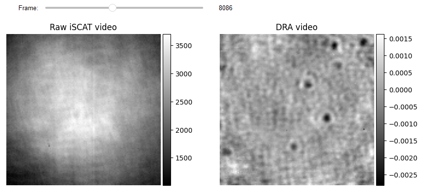
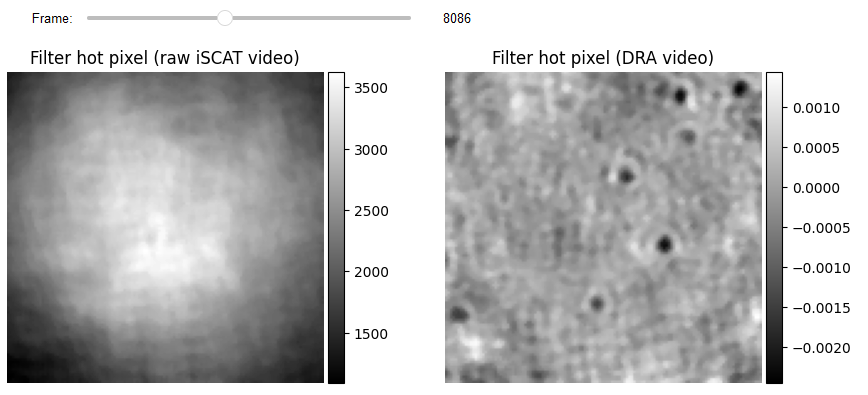
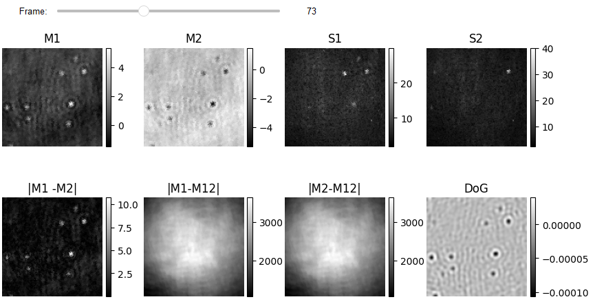
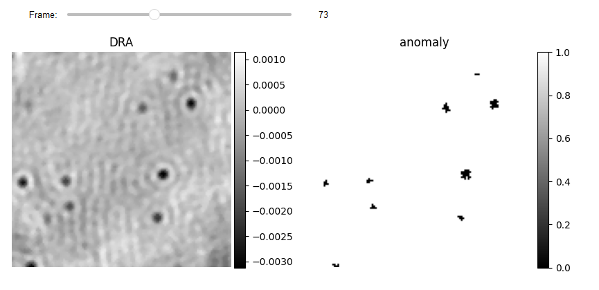
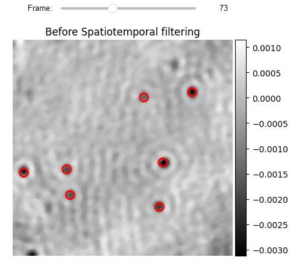

# Tutorial for anomaly detection (Hand crafted feature matrix)

Detecting low SNR PSFs is a challenging task, specially for small proteins. The main difficulty arises from the speckly background due to its similarity to a protein PSF. PiSCAT uses unsupervised machine learning methods known as anomaly detection to recognize anomalous events (e.g. protein PSF) from background data using a handcrafted feature matrix based on the isolation forest (iForest) [[1]()].

## Previously on PiSCAT tutorials...
<span style="color:red">Please install PiSCAT Plugins ``UAI`` ([link](https://piscat.readthedocs.io/installation.html#adding-piscat-plugins)) before running this tutorial!</span>.

Previously, we demonstrated how to use PiSCAT's APIs for [setting up the PiSCAT modules and downloading a demo iSCAT video](Tutorial1.ipynb#Setting-up-the-PiSCAT-modules-and-downloading-a-demo-iSCAT-video), [performing basic checks on the acquisition process](Tutorial1.ipynb#Examining-the-status-line-&-removing-it) and [basic data visualization](Tutorial1.ipynb#Display-and-inspect-a-loaded-video) and how we can used [DRA](Tutorial2.ipynb##Differential-imaging-of-averaged-iSCAT-frames) and [FPN](Tutorial3.ipynb#Tutorial-for-the-correction-of-the-fixed-pattern-noise-in-iSCAT-images-recorded-using-a-sCMOS-camera) for backgorund correction. Based on the number of available CPU cores for parallel processing, this tutorial needs 12-20 GB of computer memory (RAM) to run.


```python
# Only to ignore warnings
import warnings
warnings.filterwarnings('ignore')

# Setting up the path to the PiSCAT modules
import os
import sys
current_path = os.path.abspath(os.path.join('..'))
dir_path = os.path.dirname(current_path)
module_path = os.path.join(dir_path)
if module_path not in sys.path:
    sys.path.append(module_path)

# Downloading a measurement video for this tutorial
from piscat.InputOutput import download_tutorial_data
download_tutorial_data('Tutorial3_video')

# Examining the status line in a loaded/downloaded video and removing the line
from piscat.InputOutput import reading_videos
from piscat.Visualization import JupyterDisplay,JupyterSubplotDisplay
from piscat.InputOutput import read_status_line
from piscat.Preproccessing import normalization
from piscat.BackgroundCorrection import DifferentialRollingAverage
import numpy as np

data_path = os.path.join(dir_path, 'Tutorials', 'Demo data', 'Tutorial3', 'Tutorial3_1')#The path to the measurement data
df_video = reading_videos.DirectoryType(data_path, type_file='raw').return_df()
paths = df_video['Directory'].tolist()
video_names = df_video['File'].tolist()
demo_video_path = os.path.join(paths[0], video_names[0])#Selecting the first entry in the list
video = reading_videos.video_reader(file_name=demo_video_path, type='binary', img_width=128, img_height=128,
                                    image_type=np.dtype('<u2'), s_frame=0, e_frame=-1)#Loading the video
status_ = read_status_line.StatusLine(video)#Reading the status line
video_remove_status, status_information  = status_.find_status_line()#Examining the status line & removing it

#From previous tutorials: power normalization, FPNc, DRA
video_pn, _ = normalization.Normalization(video=video_remove_status).power_normalized()
batchSize = 500
DRA_PN = DifferentialRollingAverage(video=video_pn, batchSize=batchSize, mode_FPN='mFPN')
RVideo_PN_FPN_, _ = DRA_PN.differential_rolling(FFT_flag=False, FPN_flag=True, select_correction_axis='Both')

from piscat.Visualization.display_jupyter import JupyterSubplotDisplay
# For Jupyter notebooks only:
%matplotlib inline

# Display
list_titles = ['Raw iSCAT video', 'DRA video']
JupyterSubplotDisplay(list_videos=[video_pn[batchSize:-batchSize, ...], RVideo_PN_FPN_],
                    numRows=1, numColumns=2, list_titles=list_titles, imgSizex=10, imgSizey=10, IntSlider_width='500px',
                    median_filter_flag=False, color='gray', value=8086)
```

```lang-none
    Directory  F:\PiSCAT_GitHub_public\PiSCAT\Tutorials  already exists

    The directory with the name  Demo data  already exists in the following path: F:\PiSCAT_GitHub_public\PiSCAT\Tutorials
    Directory  Tutorial3  already exists!

    Directory  Histogram  already exists
    ---Status line detected in column---

    start power_normalized without parallel loop---> Done

    --- start DRA + mFPN_axis: Both---
      100%|#########| 18999/18999 [00:00<?, ?it/s]

    median FPN correction without parallel loop --->
      100%|#########| 19000/19000 [00:00<?, ?it/s]

    Done

    median FPN correction without parallel loop --->
      100%|#########| 19000/19000 [00:00<?, ?it/s]

    Done
```



## Hot pixels correction

The first step is to remove hot pixels from DRA and Raw iSCAT videos. This is crucial since a hot pixel can be determined as an anomaly by iForest. This is accomplished with the aid of a median filter, which has the added benefit of increasing the quality of temporal features because all temporal features incorporate information from nearby pixels.


```python
from piscat.Preproccessing import filtering

# Hot Pixels correction
video_pn_hotPixel = filtering.Filters(video_pn, inter_flag_parallel_active=False).median(3)

RVideo_PN_FPN_hotPixel = filtering.Filters(RVideo_PN_FPN_, inter_flag_parallel_active=False).median(3)

# Display
list_titles = ['Filter hot pixel (raw iSCAT video)', 'Filter hot pixel (DRA video)']
JupyterSubplotDisplay(list_videos=[video_pn_hotPixel[batchSize:-batchSize, ...], RVideo_PN_FPN_hotPixel],
                        numRows=1, numColumns=2, list_titles=list_titles,
                        imgSizex=10, imgSizey=10, IntSlider_width='500px',
                        median_filter_flag=False, color='gray', value=8086)
```

```lang-none
    ---start median filter without Parallel---

    ---start median filter without Parallel---
```


## Creating hand crafted feature matrix

Each pixel in a frame is categorized as anomalous/normal based on spatiotemporal information extracted from neighboring pixels and frames. The characteristics matrix for each frame has a 2D shape, with the number of rows corresponding to the number of pixels in the one frame and the number of columns representing Spatio-temporal features. This example has 8 temporal features (e.g. mean from batch one and two (M1, M2), the standard deviation of batch one and two (S1, S2), calibrating mean of batch one and two by removing the non-zero mean (M12)) and two spatial features (difference of Gaussian (DoG) and DRA). In this case, we skipped several frames to reduce computation time.

```python
from piscat.Plugins.UAI.Anomaly.hand_crafted_feature_genration import CreateFeatures

temporal_features = CreateFeatures(video=video_pn_hotPixel)
out_feature_t_1 = temporal_features.temporal_features(batchSize=batchSize, flag_dc=False)
out_feature_t_2 = temporal_features.temporal_features(batchSize=batchSize, flag_dc=True)

spatio_features = CreateFeatures(video=RVideo_PN_FPN_hotPixel)
dog_features = spatio_features.dog2D_creater(low_sigma=[1.7, 1.7],
                                             high_sigma=[1.8, 1.8],
                                             internal_parallel_flag=False)
# Spatio_temporal_anomaly
feature_list = []
feature_list.append(out_feature_t_1[0][0:-1:100])
feature_list.append(out_feature_t_1[1][0:-1:100])
feature_list.append(out_feature_t_1[2][0:-1:100])
feature_list.append(out_feature_t_1[3][0:-1:100])
feature_list.append(out_feature_t_1[4][0:-1:100])
feature_list.append(out_feature_t_2[0][0:-1:100])
feature_list.append(out_feature_t_2[1][0:-1:100])
feature_list.append(dog_features[0:-1:100])
feature_list.append(RVideo_PN_FPN_hotPixel[0:-1:100])

# Display features
list_titles = ['M1', 'M2', 'S1', 'S2', '|M1 -M2|', '|M1-M12|', '|M2-M12|', 'DoG']
JupyterSubplotDisplay(list_videos=feature_list[:-1],
                      numRows=2, numColumns=4, list_titles=list_titles,
                      imgSizex=10, imgSizey=5, IntSlider_width='500px',
                      median_filter_flag=False, color='gray', value=73)
```

```lang-none
    ---create temporal feature map ---
      100%|#########| 18999/18999 [00:00<?, ?it/s]

    ---create temporal feature map ---
      100%|#########| 18999/18999 [00:00<?, ?it/s]

    ---start DOG feature without parallel loop---
      100%|#########| 19000/19000 [00:00<?, ?it/s]

```


## Using iForest for creating binay mask

The collected features are fed into the `SpatioTemporalAnomalyDetection` class, which generates a feature matrix for each frame and feeds it to the specified anomaly technique (e.g. iForest). The output is a binary vector equal to the total number of pixels in the frame. `fun_anomaly` reshapes the output and produces a 2D  binary.

```python
from piscat.Plugins.UAI.Anomaly.spatio_temporal_anomaly import SpatioTemporalAnomalyDetection

# Applying anomaly detection
anomaly_st = SpatioTemporalAnomalyDetection(feature_list, inter_flag_parallel_active=False)
binary_st, _ = anomaly_st.fun_anomaly(scale=1, method='IsolationForest', contamination=0.006)

# Display
JupyterSubplotDisplay(list_videos=[RVideo_PN_FPN_hotPixel[0:-1:100], binary_st],
                      numRows=1, numColumns=2, list_titles=['DRA', 'anomaly'],
                      imgSizex=10, imgSizey=10, IntSlider_width='500px',
                      median_filter_flag=False, color='gray', value=73)
```

```lang-none
    start feature matrix genration ---> Done

    ---start anomaly without Parallel---
      100%|#########| 190/190 [00:00<?, ?it/s]

```



## Localization

The results of anomaly detection generate a binary video with zero values for the pixels that have been identified as anomalous. The number of connected pixels in a certain region indicates the likelihood that this region contains an actual iPSF. Based on the facts, the `BinaryToiSCATLocalization` class employs [morphological operations](https://scikit-image.org/docs/stable/api/skimage.morphology.html#area-closing) to eliminate low probability pixels and determine the center of mass for each highlighted area. Previous localization methods (e.g., DOG, 2D-Gaussian fit, and radial symmetry) can now be utilized to fine-tune localization with sub-pixel accuracy in the window around each center of mass.

```python
from piscat.Plugins.UAI.Anomaly.anomaly_localization import BinaryToiSCATLocalization

binery_localization = BinaryToiSCATLocalization(video_binary=binary_st,
                                                video_iSCAT=RVideo_PN_FPN_hotPixel[0:-1:100],
                                                area_threshold=4, internal_parallel_flag=False)

df_PSFs = binery_localization.gaussian2D_fit_iSCAT(scale=5, internal_parallel_flag=False)
df_PSFs.info()

```

```lang-none
    ---start area closing without Parallel---
      100%|#########| 190/190 [00:00<?, ?it/s]

    ---start gaussian filter without Parallel---

    ---start area local_minima without Parallel---
      100%|#########| 190/190 [00:00<?, ?it/s]

    ---Cleaning the df_PSFs that have side lobs without parallel loop---
      100%|#########| 190/190 [00:00<?, ?it/s]

    Number of PSFs before filters = 1206

    Number of PSFs after filters = 1107

    ---Fitting 2D gaussian without parallel loop---
      100%|#########| 1107/1107 [00:00<?, ?it/s]

    RangeIndex: 1107 entries, 0 to 1106
    Data columns (total 18 columns):
     #   Column                Non-Null Count  Dtype
    ---  ------                --------------  -----
     0   y                     1107 non-null   float64
     1   x                     1107 non-null   float64
     2   frame                 1107 non-null   float64
     3   center_intensity      1037 non-null   float64
     4   sigma                 1107 non-null   float64
     5   Sigma_ratio           1107 non-null   float64
     6   Fit_Amplitude         1085 non-null   float64
     7   Fit_X-Center          1085 non-null   float64
     8   Fit_Y-Center          1085 non-null   float64
     9   Fit_X-Sigma           1085 non-null   float64
     10  Fit_Y-Sigma           1085 non-null   float64
     11  Fit_Bias              1085 non-null   float64
     12  Fit_errors_Amplitude  1085 non-null   float64
     13  Fit_errors_X-Center   1085 non-null   float64
     14  Fit_errors_Y-Center   1085 non-null   float64
     15  Fit_errors_X-Sigma    1085 non-null   float64
     16  Fit_errors_Y-Sigma    1085 non-null   float64
     17  Fit_errors_Bias       1085 non-null   float64
    dtypes: float64(18)
    memory usage: 155.8 KB
```


```python
# Localization Display
from piscat.Visualization import JupyterPSFs_subplotLocalizationDisplay
JupyterPSFs_subplotLocalizationDisplay(list_videos=[RVideo_PN_FPN_hotPixel[0:-1:100]], list_df_PSFs=[df_PSFs],
                                        numRows=1, numColumns=1,
                                        list_titles=['Before Spatiotemporal filtering'],
                                        median_filter_flag=False, color='gray', imgSizex=5, imgSizey=5,
                                        IntSlider_width='400px', step=1, value=73)
```




### Bibliography
1. [Dahmardeh, M., Dastjerdi, H. M., Mazal, H., Köstler, H., & Sandoghdar, V. (2022). Self-supervised machine learning pushes the sensitivity limit in label-free detection of single proteins below 10 kDa.](https://assets.researchsquare.com/files/rs-1635524/v1_covered.pdf?c=1654180414)
