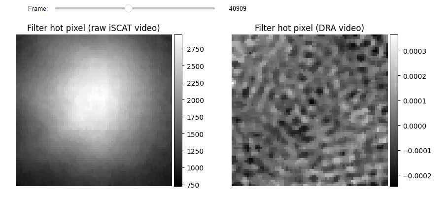
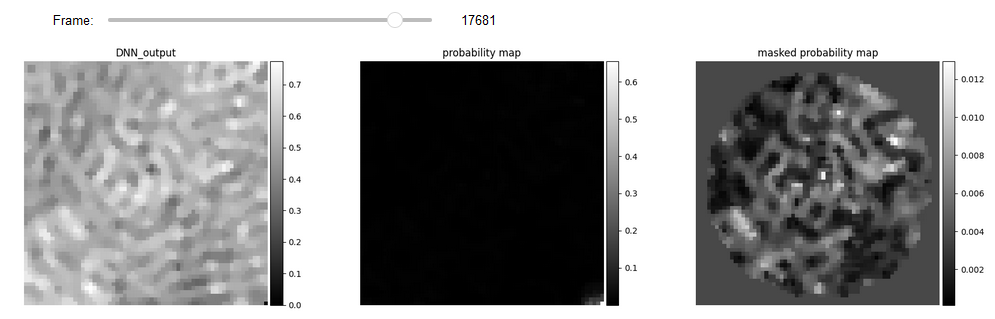
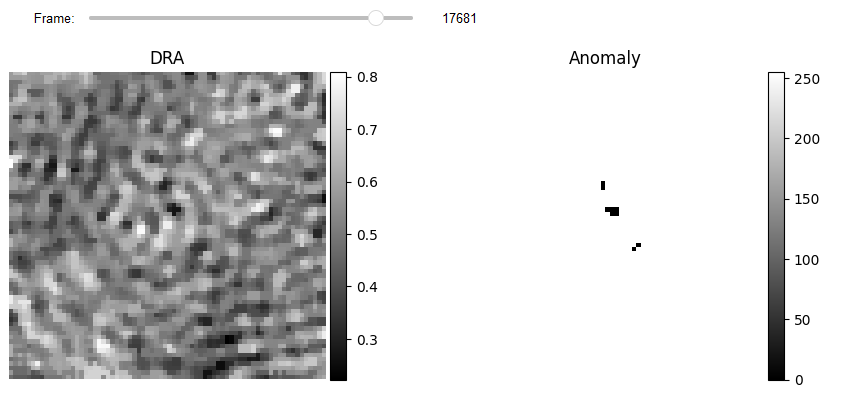
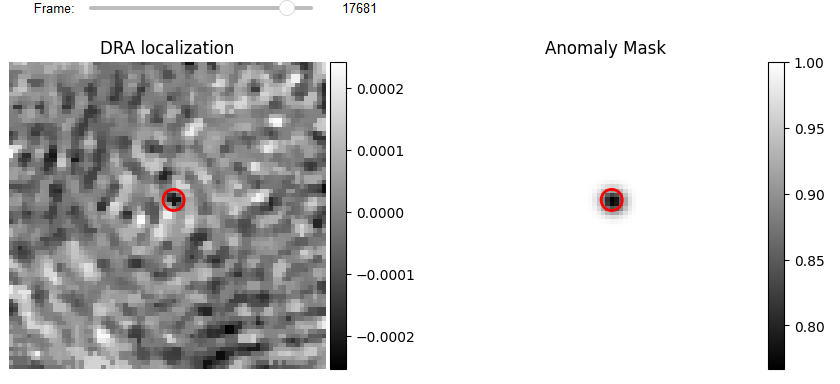
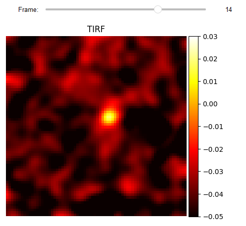
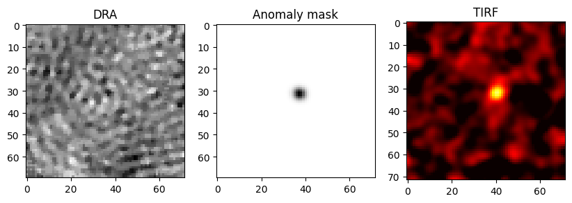

# Tutorial for anomaly detection (DNN feature matrix) 

We use the FastDVDNet model to extract suitable features for anomaly detection [[1](https://openaccess.thecvf.com/content_CVPR_2020/html/Tassano_FastDVDnet_Towards_Real-Time_Deep_Video_Denoising_Without_Flow_Estimation_CVPR_2020_paper.html)]. The outcome
is a predicted frame that is subtracted from the target frame to construct a feature map that is
used to create the feature matrix (see [Creating handcrafted feature matrix](Tutorial_anomaly_1.ipynb#Creating-hand-crafted-feature-matrix)).


## Previously on PiSCAT tutorials...
We assume the user is familiar with [PiSCAT](https://piscat.readthedocs.io/). In particular, we have previously demonstrated how
to use PiSCAT’s APIs for setting up the PiSCAT modules and downloading a demo iSCAT video,
performing basic checks on the acquisition process and basic data visualization and how one can
use [DRA](https://piscat.readthedocs.io/Tutorial2/Tutorial2.html#frame-averaging-to-boost-snr-of-imaged-proteins-followed-by-visualization-of-their-signal-via-differential-imaging) and [FPN](https://piscat.readthedocs.io/Tutorial3/Tutorial3.html#tutorial-for-the-correction-of-the-fixed-pattern-noise-in-iscat-images-recorded-using-a-scmos-camera) for backgorund correction. We have also demonstrated how to reduce the hot
pixel effects. Based on the number of available CPU cores for parallel processing, this tutorial needs
12-30 GB of computer memory (RAM) to run. We also use tensor flow, which can utilize GPU for
improving the performance of the DNN training/testing.


```python
# Only to ignore warnings
import warnings
warnings.filterwarnings('ignore')

# Setting up the path to the PiSCAT modules
import os
import sys
current_path = os.path.abspath(os.path.join('..'))
dir_path = os.path.dirname(current_path)
module_path = os.path.join(dir_path)
if module_path not in sys.path:
    sys.path.append(module_path)
    
# Downloading a measurement video for this tutorial 
from piscat.InputOutput import download_tutorial_data
download_tutorial_data('Tutorial_UAI')
     
# Examining the status line in a loaded/downloaded video and removing the line
from piscat.InputOutput import reading_videos
from piscat.Visualization import JupyterDisplay,JupyterSubplotDisplay 
from piscat.InputOutput import read_status_line
from piscat.Preproccessing import normalization
from piscat.BackgroundCorrection import DifferentialRollingAverage
import numpy as np

data_path = os.path.join(dir_path, 'Tutorials', 'Demo data', 'UAI', '9KDa')#The path to the measurement data
df_video = reading_videos.DirectoryType(data_path, type_file='bin').return_df()
paths = df_video['Directory'].tolist()
video_names = df_video['File'].tolist()
demo_video_path = os.path.join(paths[0], video_names[0])#Selecting the first entry in the list
video_ = reading_videos.video_reader(file_name=demo_video_path, type='binary', img_width=72, img_height=72, 
                                    image_type=np.dtype('<u2'), s_frame=0, e_frame=-1)#Loading the video

video = video_[1000:90000, ...]# Trimming the data and setting it to where iSCAT measurement is started.

status_ = read_status_line.StatusLine(video)#Reading the status line
video_remove_status, status_information  = status_.find_status_line()#Examining the status line & removing it

#From previous tutorials: power normalization, FPNc, DRA
video_pn, _ = normalization.Normalization(video=video_remove_status).power_normalized()
batchSize = 7000
DRA_PN = DifferentialRollingAverage(video=video_pn, batchSize=batchSize, mode_FPN='mFPN')
RVideo_PN_FPN_, _ = DRA_PN.differential_rolling(FFT_flag=False, FPN_flag=True, select_correction_axis='Both')

from piscat.Preproccessing import filtering

# Hot Pixels correction
video_pn_hotPixel = filtering.Filters(video_pn, inter_flag_parallel_active=False).median(3)

RVideo_PN_FPN_hotPixel = filtering.Filters(RVideo_PN_FPN_, inter_flag_parallel_active=False).median(3)

from piscat.Visualization.display_jupyter import JupyterSubplotDisplay
# For Jupyter notebooks only:
%matplotlib inline

# Display 
list_titles = ['Filter hot pixel (raw iSCAT video)', 'Filter hot pixel (DRA video)']
JupyterSubplotDisplay(list_videos=[video_pn_hotPixel, RVideo_PN_FPN_hotPixel], 
                        numRows=1, numColumns=2, list_titles=list_titles, 
                        imgSizex=10, imgSizey=5, IntSlider_width='500px',
                        median_filter_flag=False, color='gray', value=40909)
```

 ```lang-none     
    Directory  F:\PiSCAT_GitHub_public\PiSCAT\Tutorials  already exists
    
    The directory with the name  Demo data  already exists in the following path: F:\PiSCAT_GitHub_public\PiSCAT\Tutorials
    
    The data file named  UAI  already exists in the following path: F:\PiSCAT_GitHub_public\PiSCAT\Tutorials\Demo data
    ---Status line detected in column---
    
    start power_normalized without parallel loop---> Done
    
    --- start DRA + mFPN_axis: Both---
      100%|#########| 74999/74999 [00:00<?, ?it/s]

    median FPN correction without parallel loop ---> 
      100%|#########| 75000/75000 [00:00<?, ?it/s]

    Done
    
    median FPN correction without parallel loop ---> 
      100%|#########| 75000/75000 [00:00<?, ?it/s]
    Done
    
    ---start median filter without Parallel---
    
    ---start median filter without Parallel---
```



## Training
<font color='red'> Since the training process is time-consuming, especially on the CPU, and requires fine-tuning, we share pre-trained weights. Thus, you can skip to the [Testing](http://localhost:8888/notebooks/Tutorial_Files/Tutorial_anomaly_2.ipynb#Testing) stage.</font>

As a first step for training the fastdvdnet, the data needs to be normalized. This is done by using `normalized_image_global`, which renders a video with values between zero and one. FatDVDNet requires the data of the following shape: (#batches, image width, image height, #frame (always 5)),
which can be created by using the `data_handling` function. The output of this class can then be fed
into a tarining model.


```python
from piscat.Preproccessing.normalization import Normalization

# Normalization
train_video = RVideo_PN_FPN_hotPixel[30000:50000:1]
video_norm = Normalization(train_video).normalized_image_global()

# Training
from piscat.Plugins.UAI.DNNModel.FastDVDNet import FastDVDNet

dnn_ = FastDVDNet(video_original=video_norm)
batch_original_array, _ = dnn_.data_handling(stride=50)

save_DNN_path = os.path.join(dir_path, 'Tutorials', 'Demo data')#The path to the measurement data

hyperparameters = {'DNN_batch_size':20, 'epochs': 100, 'shuffle': False, 'validation_split': 0.33}
dnn_.train(video_input_array=batch_original_array,
           DNN_param=hyperparameters,
           video_label_array=None,
           path_save=save_DNN_path, name_weights="anomaly_weights_new.h5", flag_warm_train=False)
```

```lang-none  
    --- model tarin on CPU---!
    Epoch 1/100
     49/662 [=>............................] - ETA: 35:08 - loss: 0.0644
```


## Testing

Results of DNN can be seen here. Due to artifacts that occur around edges and corners, we use the
`Mask2Video` class to apply a circular mask on the video.


```python
save_DNN_path = os.path.join(dir_path, 'Tutorials', 'Demo data', 'UAI')#The path to the measurement data


from piscat.Preproccessing.normalization import Normalization

# Normalization
test_video = RVideo_PN_FPN_hotPixel[30000:50000:1]
video_norm = Normalization(test_video).normalized_image_global()

# Training
from piscat.Plugins.UAI.DNNModel.FastDVDNet import FastDVDNet

dnn_ = FastDVDNet(video_original=video_norm)
batch_original_array, cropped_video = dnn_.data_handling(stride=1)


feature_DNN = dnn_.test(video_input_array=batch_original_array, path_save=save_DNN_path, 
          name_weights="anomaly_weights.h5")

from piscat.Preproccessing.applying_mask import Mask2Video

diff_vid = np.abs(cropped_video[2:-2, ...] - feature_DNN)
M2Vid = Mask2Video(diff_vid, mask=None, inter_flag_parallel_active=False)
circlur_mask = M2Vid.mask_generating_circle(center=(int(diff_vid.shape[1]/2), int(diff_vid.shape[2]/2)), 
                                            redius=30)
video_mask = M2Vid.apply_mask(flag_nan=False)

# Display 
list_titles = ['DNN_output', 'probability map', 'masked probability map']
JupyterSubplotDisplay(list_videos=[feature_DNN, diff_vid, video_mask], 
                        numRows=1, numColumns=3, list_titles=list_titles, 
                        imgSizex=20, imgSizey=20, IntSlider_width='500px',
                        median_filter_flag=True, color='gray', value=17681)
```

```lang-none  
    ---Loaded model weights from disk!---
    --- model test on CPU---!
    625/625 [==============================] - 673s 1s/step
    --- Mask is not define! ---
    
    ---apply mask without Parallel---
      100%|#########| 19996/19996 [00:00<?, ?it/s]
      100%|#########| 19996/19996 [00:00<?, ?it/s]

```



```python
from piscat.Plugins.UAI.Anomaly.hand_crafted_feature_genration import CreateFeatures

feature_maps_spatio = CreateFeatures(video=cropped_video[2:-2, ...])
dog_features = feature_maps_spatio.dog2D_creater(low_sigma=[1.7, 1.7], high_sigma=[1.8, 1.8], internal_parallel_flag=False)


from piscat.Plugins.UAI.Anomaly.DNN_anomaly import DNNAnomaly

if_dnn = DNNAnomaly([video_mask, dog_features], contamination=0.002)
mask_video_ = if_dnn.apply_IF_spacial_temporal(step=10, stride=200)


from piscat.Preproccessing.normalization import Normalization

r_diff = int(0.5 * abs(mask_video_.shape[1] - video_norm.shape[1]))
c_diff = int(0.5 * abs(mask_video_.shape[2] - video_norm.shape[2]))

mask_video_pad = np.pad(mask_video_, ((0, 0), (r_diff, r_diff), (c_diff, c_diff)), 'constant', constant_values=((0, 0), (1, 1), (1, 1)))

result_anomaly_ = mask_video_pad.copy()
result_anomaly_[mask_video_pad == -1] = 0
result_anomaly_ = Normalization(video=result_anomaly_.astype(int)).normalized_image_specific()

# Display 
JupyterSubplotDisplay(list_videos=[video_norm, result_anomaly_], 
                                    numRows=1, numColumns=2, list_titles=['DRA', 'Anomaly'], 
                                    imgSizex=10, imgSizey=10, IntSlider_width='500px',
                                    median_filter_flag=False, color='gray', value=17681)
```

```lang-none      
    ---start DOG feature without parallel loop---
      100%|#########| 19996/19996 [00:00<?, ?it/s]
    
    ---start anomaly with Parallel---    
      100%|#########| 19996/19996 [00:00<?, ?it/s]
    
    converting video bin_type to uint8---> Done
   
```



## Localization

The results of anomaly detection generate a binary video with zero values for the pixels that have
been identified as anomalous. The number of connected pixels in a certain region indicates the
likelihood that this region contains an actual iPSF. The `BinaryToiSCATLocalization` class employs
[morphological operations](https://scikit-image.org/docs/stable/api/skimage.morphology.html#area-closing) to eliminate low probability pixels and to determine the center of mass
for each highlighted area. Previous localization methods (e.g., DOG, 2D-Gaussian fit, and radial
symmetry) can now be utilized to fine tune localization with sub-pixel accuracy in the window
around each center of mass.


```python
from piscat.Plugins.UAI.Anomaly.anomaly_localization import BinaryToiSCATLocalization

binery_localization = BinaryToiSCATLocalization(video_binary=result_anomaly_, sigma=1.7, 
                                                video_iSCAT=test_video, 
                                                area_threshold=3, internal_parallel_flag=False)

df_PSFs = binery_localization.gaussian2D_fit_iSCAT(scale=1, internal_parallel_flag=False)
df_PSFs.info()
```

```lang-none      
    ---start area closing without Parallel---
      100%|#########| 19996/19996 [00:00<?, ?it/s]
      
    ---start gaussian filter without Parallel---
    
    ---start area local_minima without Parallel---
      100%|#########| 19996/19996 [00:00<?, ?it/s]
    
    ---Cleaning the df_PSFs that have side lobs without parallel loop---
      100%|#########| 10680/10680 [00:00<?, ?it/s]

    Number of PSFs before filters = 16813    
    Number of PSFs after filters = 12071
    
    ---Fitting 2D gaussian without parallel loop---
      100%|#########| 12071/12071 [00:00<?, ?it/s]

    RangeIndex: 12071 entries, 0 to 12070
    Data columns (total 18 columns):
     #   Column                Non-Null Count  Dtype  
    ---  ------                --------------  -----  
     0   y                     12071 non-null  float64
     1   x                     12071 non-null  float64
     2   frame                 12071 non-null  float64
     3   center_intensity      9952 non-null   float64
     4   sigma                 12071 non-null  float64
     5   Sigma_ratio           12071 non-null  float64
     6   Fit_Amplitude         11612 non-null  float64
     7   Fit_X-Center          11612 non-null  float64
     8   Fit_Y-Center          11612 non-null  float64
     9   Fit_X-Sigma           11612 non-null  float64
     10  Fit_Y-Sigma           11612 non-null  float64
     11  Fit_Bias              11612 non-null  float64
     12  Fit_errors_Amplitude  11612 non-null  float64
     13  Fit_errors_X-Center   11612 non-null  float64
     14  Fit_errors_Y-Center   11612 non-null  float64
     15  Fit_errors_X-Sigma    11612 non-null  float64
     16  Fit_errors_Y-Sigma    11612 non-null  float64
     17  Fit_errors_Bias       11612 non-null  float64
    dtypes: float64(18)
    memory usage: 1.7 MB
```    


```python
# Localization Display
from piscat.Visualization import JupyterPSFs_subplotLocalizationDisplay
JupyterPSFs_subplotLocalizationDisplay(list_videos=[test_video, binery_localization.blure_video], 
                                       list_df_PSFs=[df_PSFs, df_PSFs], 
                                        numRows=1, numColumns=2, 
                                        list_titles=['DRA localization', 'Anomaly Mask'], 
                                        median_filter_flag=False, color='gray', imgSizex=10, imgSizey=10, 
                                        IntSlider_width='400px', step=1, value=17681)
```



## loading TIRF

To check the validity of the localization, the corresponding frames of the TIRF measurement are loaded.


```python
data_path_Flo = os.path.join(dir_path, 'Tutorials', 'Demo data', 'UAI', 'TIRF')#The path to the measurement data
df_video_Flo = reading_videos.DirectoryType(data_path_Flo, type_file='raw').return_df()
paths_Flo = df_video_Flo['Directory'].tolist()
video_names_Flo = df_video_Flo['File'].tolist()
demo_video_path_Flo = os.path.join(paths_Flo[0], video_names_Flo[0])#Selecting the first entry in the list
video_Flo = reading_videos.video_reader(file_name=demo_video_path_Flo, type='binary', img_width=72, img_height=72, 
                                    image_type=np.dtype('<f8'), s_frame=0, e_frame=-1)#Loading the video

from piscat.Preproccessing import filtering

# Hot Pixels correction
video_flo_hotPixel_ = filtering.Filters(video_Flo, inter_flag_parallel_active=False).median(3)
video_flo_hotPixel = filtering.Filters(video_flo_hotPixel_, inter_flag_parallel_active=False).gaussian(1.8)


JupyterSubplotDisplay(list_videos=[video_flo_hotPixel], 
                    numRows=1, numColumns=1, list_titles=['TIRF'], imgSizex=5, imgSizey=5, IntSlider_width='500px',
                    median_filter_flag=False, color='hot', value=14, vmin=-0.05, vmax=0.03)

```

 ```lang-none     
    ---start median filter without Parallel---
    
    ---start gaussian filter without Parallel---
```




```python
import matplotlib.pyplot as plt
fig, (ax1, ax2, ax3) = plt.subplots(1, 3, figsize=(10,5))
ax1.imshow(test_video[17423], cmap='gray')
ax2.imshow(binery_localization.blure_video[17423], cmap='gray')
ax3.imshow(video_flo_hotPixel[14], cmap='hot', vmin=-0.05, vmax=0.03)
ax1.title.set_text('DRA')
ax2.title.set_text('Anomaly mask')
ax3.title.set_text('TIRF')
plt.show()
```


    

### Bibliography
1. [Tassano, Matias, Julie Delon, and Thomas Veit. "Fastdvdnet: Towards real-time deep video denoising without flow estimation." Proceedings of the IEEE/CVF Conference on Computer Vision and Pattern Recognition. 2020.](https://openaccess.thecvf.com/content_CVPR_2020/html/Tassano_FastDVDnet_Towards_Real-Time_Deep_Video_Denoising_Without_Flow_Estimation_CVPR_2020_paper.html)
