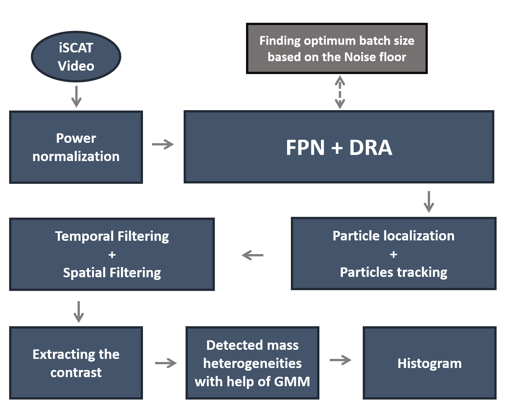
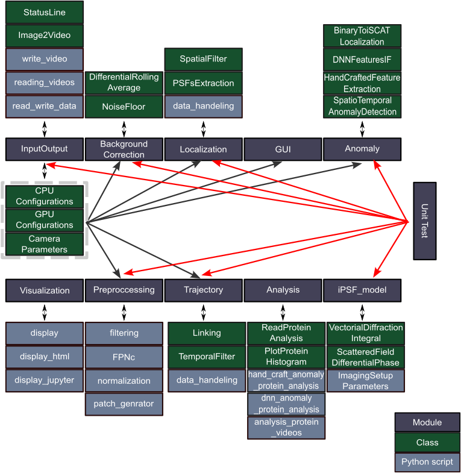

Appendix
========

Summary of the PiSCAT pipeline for efficient nanoparticle detection
-------------------------------------------------------------------

The implementation flowchart for detecting single unlabeled proteins from iSCAT videos is shown in the following Fig [1].

Structure of the PiSCAT
-----------------------

The PiSCAT structure is depicted in the following diagram. [2].

PiSCAT publications
-------------------
[1] Dastjerdi, Houman Mirzaalian, et al. "Optimized analysis for sensitive detection and analysis of single proteins via interferometric scattering microscopy." Journal of Physics D: Applied Physics 55.5 (2021): 054002. (`Journal <https://iopscience.iop.org/article/10.1088/1361-6463/ac2f68>`_)

[2] Mirzaalian Dastjerdi, Houman, et al. "PiSCAT: A Python Package for Interferometric Scattering Microscopy." The Journal of Open Source Software 7.71 (2022). (`Journal <https://doi.org/10.21105/joss.04024>`_)

